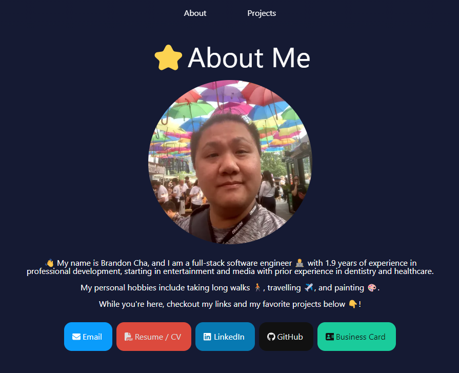
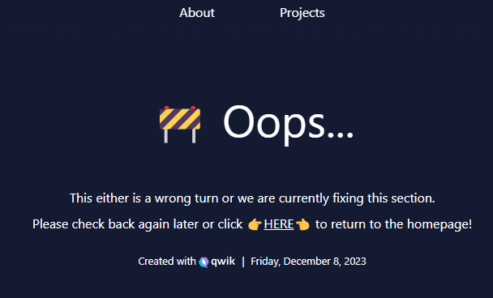

# Portfolio created with QwikJS and QwikCity ⚡️



Hi, so this is a bit of a passion project of mine and I wanted to experiment with some fast-running framework, and what better to do it than for a portfolio when building a near-O(1) complexity framework!

While I'll be periodicially update this site as needed (e.g. adding animations and stuff), I hope you can also appreciate the wonders of this underrated framework!

---

### Live: TBD

---

#### More information on QwikJS here: [Docs](https://qwik.builder.io/) | [Discord](https://qwik.builder.io/chat) | [GitHub](https://github.com/BuilderIO/qwik) | [X](https://twitter.com/QwikDev) | [Vite](https://vitejs.dev/)

---

## Portfolio Structure

This project uses [QwikCity](https://qwik.builder.io/qwikcity/overview/) to maintain a tree directory on top of Qwik to make it easier to build a full site.

Only the About page and the Projects page are available at this time.

<!-- TO BE ADDED IN THE FUTURE: The layout will vary between mobile and tablet/desktop views above 768px. -->

```
├ About (../components/feature/About.tsx)
└ Projects (../components/feature/Projects.tsx)
```

## Custom 404 Page



## Integrations and Deployment

The site is currently using Vercel Edge for deployment.
Vitest is also used for unit testing and custom component rendering checks prior to deployment changes.

## Steps to Run in Local Host

1. Clone repository to your machine (e.g. Git Clone `HTTP` or `SSH`)
2. Open the terminal of your choice and use `npm install` or `yarn install` to install the dependencies on your machine
3. Run the site on your machine with `npm run dev`

Other Useful Commands:

|                    |                                       |
| ------------------ | ------------------------------------- |
| `qwik`             | Run Qwik                              |
| `npm run test`     | Run vitest for unit testing           |
| `npm run build`    | Run Qwik to create a deployment build |
| `npm run preview`  | Run Qwik to view the deployment build |
| `npm run deploy`   | Run Vercel to Deploy to Edge          |
| `npm run prettier` | Run Prettier to Inspect and Fix       |
| `npm run lint`     | Run eslint                            |
